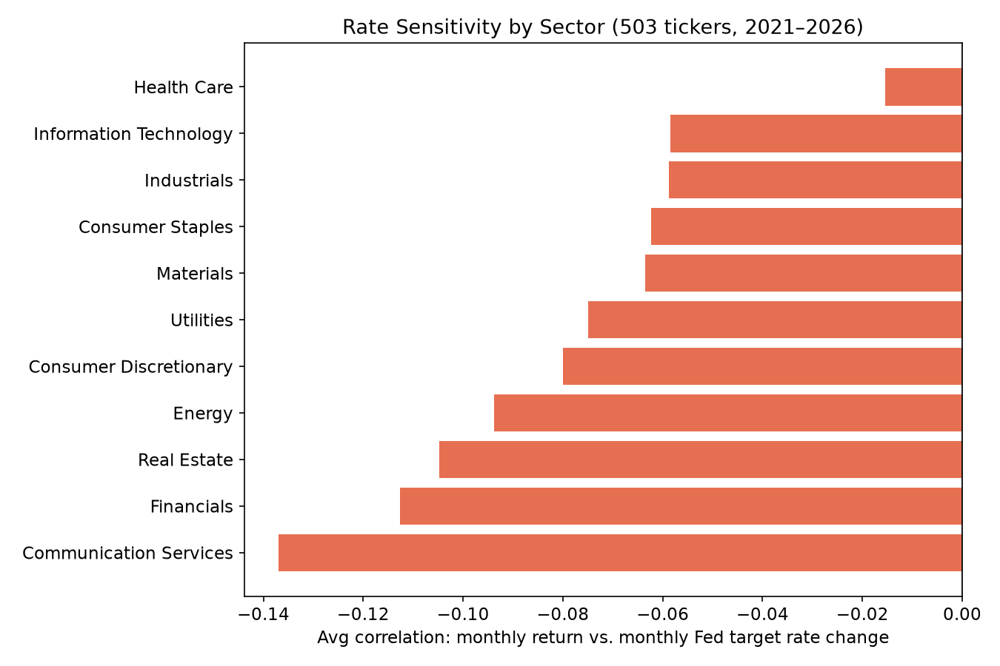
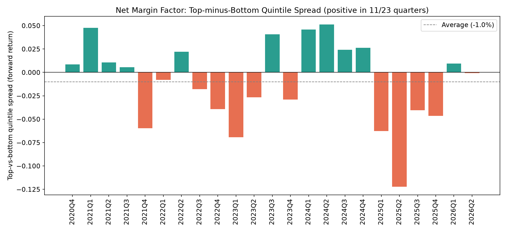
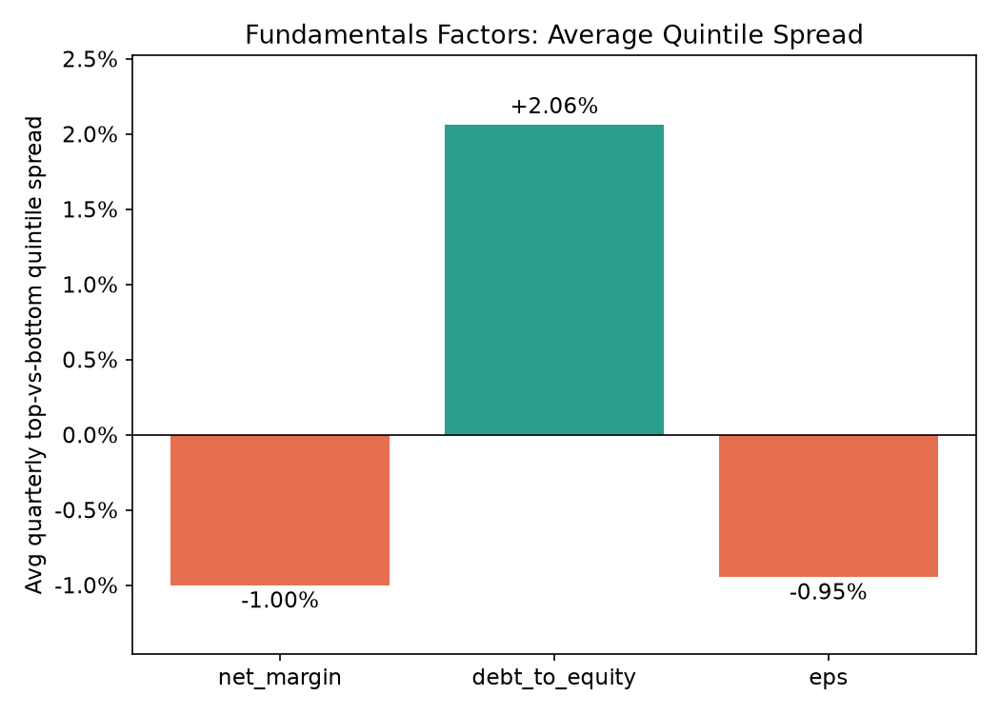

# Finance ETL & Insights Pipeline — Project Write-Up

A pipeline combining daily prices (yfinance), SEC EDGAR filings and XBRL
fundamentals, and Federal Reserve data (FRED) for all 503 current S&P 500
companies, 2021–2026, used to test three pieces of conventional market
wisdom.

## Summary

| Question | Answer | Confidence |
|---|---|---|
| Do sectors react to Fed rate changes the way conventional wisdom says? | Every sector leaned negative (Financials among the most), but no sector's effect is distinguishable from chance. | Not significant: 18 rate decisions is too few. |
| Does volatility cluster around earnings or Fed decisions? | Both. Earnings filings: 1.54x normal volatility. Fed decisions: 1.25x. | Significant: both far exceed random-date placebos (p < 0.01). |
| Do net margin, leverage or EPS predict next-quarter returns? | No. All three spreads are within noise of zero. | Not significant: all \|t\| < 2. |

The most useful part of the project was the data work. **Six data-quality
issues** were found and fixed, each with before/after evidence (below).
One of them (issue 5), plus two analysis bugs, changed the conclusions,
and those changes are documented rather than quietly patched. The fixes are covered
by 18 unit tests, including tests that fail if the original bugs are
put back.

## Contents
1. [Architecture](#architecture)
2. [Data quality: issues found and fixed](#data-quality-issues-found-and-fixed)
3. [Analysis 1: Rate sensitivity by sector](#analysis-1-rate-sensitivity-by-sector)
4. [Analysis 2: Volatility around events](#analysis-2-volatility-around-events)
5. [Analysis 3: Fundamentals vs. forward returns](#analysis-3-fundamentals-vs-forward-returns)
6. [How the conclusions changed](#how-the-conclusions-changed)
7. [Limitations](#limitations)
8. [How to reproduce](#how-to-reproduce)

---

## Architecture

A star schema in DuckDB (file-based analytical SQL, no server), built by
one command:

```
run_pipeline.py
  ├── load/create_schema.py       dimensions + facts, FK-constrained
  ├── load/populate_dim_date.py   calendar dimension
  ├── extract/prices.py           yfinance  → fact_daily_price
  ├── extract/filings.py          SEC EDGAR → fact_filing, fact_fundamentals
  ├── extract/macro.py            FRED      → fact_macro_observation
  └── transform/build_views.py    joined analytical views
```

Three views turn the facts into an analysis-ready table:

- **`macro_daily`** forward-fills each macro series to every calendar day
  with DuckDB's `ASOF JOIN`.
- **`fundamentals_dated`** gives each fundamentals row an
  `effective_date`: the SEC filing date on which it first became public.
- **`analytics_daily`** is one row per company per trading day, joining
  prices, macro data and fundamentals. Fundamentals are matched with
  `ASOF JOIN` on `effective_date <= trading_date`, so no day can see
  numbers that weren't public yet.

| Source | Data | Notes |
|---|---|---|
| yfinance | Daily prices | Unofficial and can throttle; extraction retries with backoff and skips a failing ticker instead of crashing. |
| SEC EDGAR | 10-K/10-Q/8-K metadata, XBRL fundamentals | Official, requires a descriptive User-Agent. The messiest source by far. |
| FRED | Fed target rate (daily), effective Fed funds rate, 10Y Treasury, CPI, unemployment, GDP | Official and clean. |

**Scale**: 503 companies, ~717K daily price rows, ~45.3K filings, ~11.9K
fundamentals rows, ~3.8K macro observations. A full run takes about 25
minutes, mostly SEC rate limiting, and is idempotent.

## Data quality: issues found and fixed

**1. XBRL tag switching.** ADP had revenue for only 8 of 29 periods.
Companies sometimes switch which XBRL tag they report a concept under
(many changed revenue tags when ASC 606 took effect), and the extractor
stopped at the first tag with any data. *Fix*: merge all candidate tags
in priority order. ADP: 8/29 → 28/30 periods.

**2. Quarterly vs. year-to-date collisions.** AAPL's quarterly revenue
came out as $313.7B. A 10-Q often reports both the quarter and the
year-to-date total under the same tag and end date, differing only in
start date, and the extractor sometimes kept the year-to-date figure.
*Fix*: keep only ~91-day and ~365-day windows. AAPL: $313.7B → $94.0B,
matching its reported figure.

**3. Source schema mismatch.** After scaling from 10 hand-picked
tickers to the live S&P 500 list, 493 of 503 companies loaded with no
name or sector. The live CSV's headers (`Security`, `GICS Sector`)
didn't match the ones the code expected (`Name`, `Sector`). *Fix*:
correct the mapping and add a backfill, because the insert-only upsert
would never repair rows that already existed.

**4. Index reconstitution.** Three tickers (BLDR, TAP, TTD) were loaded
while in the index and later removed, so the live list no longer covers
them and they have no sector. They are excluded from sector analysis.
This is the same mechanism that causes survivorship bias (see
Limitations).

**5. Fundamentals dated by their latest filing, not their first.** The
median fundamentals row was dated about 400 days after its period ended.
Every 10-K/10-Q repeats earlier periods as comparatives, and the
extractor kept the *most recent* filing of each value, so a quarter was
usually dated by the next year's report. No future data leaked, but
every fundamentals analysis was about a year stale. *Fix*: keep the
first filed value, and date each row by the latest first release among
its values. Median lag: ~400 → 35 days.

**6. EPS silently empty.** EPS was missing for every company. An earlier
draft blamed the fix for issue 2; the real cause was that the extractor
only read the `USD` unit, while per-share values are reported in
`USD/shares`. *Fix*: read both units. EPS coverage: 0 → 93% of rows.

## Analysis 1: Rate sensitivity by sector

**Question**: do sectors react to Fed rate changes as conventional
wisdom predicts (tech hurt by hikes, financials helped, utilities and
real estate hurt)?

**Method**: for each stock, the correlation between monthly total return
and the monthly change in the Fed's target rate (FRED `DFEDTARU`),
averaged by sector. The rate changed in 18 of 68 months: 11 hikes in
2022–23, cuts in 2024–25 and a hike in September 2026.

**Significance**: stocks aren't independent (they all react to the same
decisions), so a standard t-test would overstate confidence. Instead, a
permutation test shuffles which months had rate changes, using the same
shuffle for every stock, and recomputes each sector average 10,000
times. The p-value is the share of shuffles with an average at least as
far from zero as the real one.

| Sector | Avg correlation | Stocks | p-value |
|---|---|---|---|
| Communication Services | −0.137 | 23 | 0.04 |
| Financials | −0.113 | 76 | 0.16 |
| Real Estate | −0.105 | 30 | 0.25 |
| Energy | −0.094 | 21 | 0.32 |
| Consumer Discretionary | −0.080 | 47 | 0.27 |
| Utilities | −0.075 | 31 | 0.43 |
| Materials | −0.064 | 25 | 0.41 |
| Consumer Staples | −0.062 | 33 | 0.38 |
| Industrials | −0.059 | 83 | 0.45 |
| Information Technology | −0.058 | 74 | 0.40 |
| Health Care | −0.015 | 60 | 0.82 |
| **All sectors** | **−0.073** | **503** | **0.25** |



**Finding**: every sector leans negative, and the ordering runs against
conventional wisdom. Financials are among the most rate-negative sectors
rather than beneficiaries, and Information Technology is among the
least. But **none of this is statistically reliable**. Communication
Services has p = 0.04, but with 11 sectors tested, one p-value that low
is expected by chance. The consistent sign isn't strong evidence either:
sectors move together, so eleven negative averages are closer to one
market-wide observation than eleven independent ones, and that
market-wide average has p = 0.25.

The honest conclusion is that 18 rate decisions, most of them in one
hiking cycle, aren't enough to measure sector rate sensitivity from
monthly returns.

## Analysis 2: Volatility around events

**Question**: does volatility cluster more around company-specific
events (earnings filings) or macro events (Fed decisions)?

**Method**: an event study. Earnings events are 10-Q/10-K filing dates;
Fed events are the 18 days the target rate changed. `DFEDTARU` records
the effective date, the trading day after the announcement, so a ±1-day
window covers the announcement. For each event type, mean absolute
daily return inside the window is compared with all other days, at ±1
and ±5 trading days.

**Significance**: a placebo test places the same number of fake events
on random trading days (shared across stocks for Fed events, per company
for earnings) and recomputes the ratio 2,000 times for Fed events and
200 times for earnings. The p-value is the share of placebo ratios at
least as high as the real one.

| Event type | Events | ±1 day | p | ±5 days | p |
|---|---|---|---|---|---|
| Earnings filings | 10,906 | **1.54x** | < 0.01 | **1.20x** | < 0.01 |
| Fed rate changes | 18 | **1.25x** | < 0.01 | **1.12x** | 0.04 |

For scale: the 95th percentile of placebo ratios at ±1 day was 1.01x
for earnings and 1.12x for Fed events.


**Finding**: both event types raise volatility, and both effects fade as
the window widens, as expected from a sharply timed event. Earnings
filings have the bigger effect, and it's probably understated: the
earnings announcement itself often comes days to weeks before the
filing. Fed decisions raise volatility by about 25% on the day, even
though most were well telegraphed, so rate expectations aren't fully
priced in beforehand. The Fed effect at ±5 days is borderline: most of
it happens right at the decision.

## Analysis 3: Fundamentals vs. forward returns

**Question**: do net margin, debt-to-equity or EPS predict the next
quarter's returns?

**Method**: a quintile spread test, the standard factor-investing
method. In each quarter, companies are ranked into five groups by the
factor, and the test measures the highest group's average return over
the next 63 trading days minus the lowest group's. Returns start from
each value's first public filing date, and only values released within
120 days of the period end are used, so companies are ranked on fresh
numbers. 23 quarterly cohorts, 2020Q4–2026Q2.

**Significance**: each quarter's spread is one observation, so the
t-stat is the mean spread divided by its standard error across quarters.

| Factor | Avg spread (high − low) | Quarters positive | t-stat |
|---|---|---|---|
| Net margin | −1.00% | 11 / 23 | −1.09 |
| Debt-to-equity | +2.06% | 15 / 23 | +1.64 |
| EPS | −0.95% | 11 / 23 | −0.94 |





**Finding**: none of the three factors reliably predicted returns. Net
margin and EPS were positive in 11 of 23 quarters, a coin flip.
Debt-to-equity came closest (15 of 23), but t = 1.64 isn't significant,
and survivorship bias pushes in exactly that direction: highly leveraged
companies that failed are mostly missing from a list of today's
constituents. For large caps over five years, it's unsurprising that the
most widely followed numbers are already priced in by the time the
filing appears.

## How the conclusions changed

Two conclusions reversed during the project as bugs were found. Both
are kept here because they're a better record of the work than the
final numbers alone.

**Fed volatility: 0.97x → 1.25x.** The first version defined Fed events
using `FEDFUNDS`, a *monthly average* dated the 1st of each month. Most
of its "changes" were a few basis points of averaging drift, on dates
unrelated to any Fed meeting, so finding no effect was nearly
guaranteed. Switching to the daily target rate (`DFEDTARU`) gave real
decision dates and a real effect.

**Net margin: three versions.**

| Version | Result | What was wrong |
|---|---|---|
| 1 | +6.44%, positive in 31/31 quarters | The spread was the best-performing group minus the worst-performing one, whichever groups those were. It can never be negative, so 31/31 was guaranteed. |
| 2 | −3.09%, positive in 5/31 quarters | Sign fixed, but fundamentals were a year stale (issue 5). |
| 3 | −1.00%, positive in 11/23 quarters, t = −1.09 | First-release, fresh data. No real effect. |

Version 1 looked like the project's strongest result and was entirely a
bug. Version 2 looked like a clean reversal and disappeared once the
data was point-in-time. Both are now covered by regression tests.

## Limitations

- **Survivorship bias.** The universe is *today's* S&P 500. Companies
  that failed or left the index during 2021–2026 are mostly missing,
  which flatters any backtest, especially for leverage.
- **Few Fed events.** Analyses 1 and 2 rest on 18 decisions, 11 of them
  in one hiking cycle.
- **Earnings dates are filing dates.** The announcement usually comes
  earlier, so Analysis 2 likely understates the earnings effect.
- **Short factor history.** 23 quarters can't separate a real 1–2% per
  quarter effect from noise. First-release values are used by design, so
  later restatements are ignored. No risk adjustment, benchmark or
  transaction costs.
- **`total_debt` is total liabilities**, not interest-bearing debt; no
  single XBRL tag covers the latter across companies.
- **yfinance is unofficial** and the least stable source.

## How to reproduce

```bash
python3 -m venv venv && source venv/bin/activate
pip install -r requirements.txt
# .env needs FRED_API_KEY and SEC_USER_AGENT (see README)

python3 run_pipeline.py --start 2021-01-01 --end 2026-12-31   # ~25 min

python3 analysis/rate_sensitivity.py
python3 analysis/event_volatility.py --window 5
python3 analysis/fundamentals_factors.py
python3 analysis/significance.py        # permutation and placebo tests
python3 analysis/make_charts.py

python3 -m pytest                       # 18 tests, no network or database needed
```
