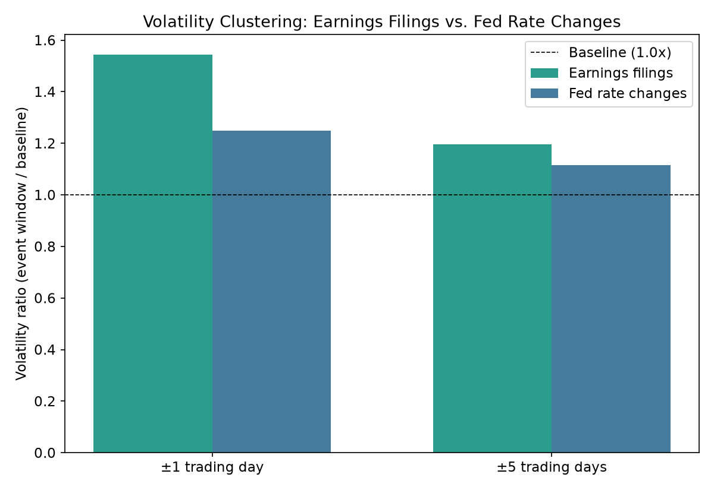

# Finance ETL & Insights Pipeline

An ETL pipeline combining daily stock prices (yfinance), SEC EDGAR filings
and XBRL fundamentals, and Federal Reserve data (FRED) for all 503 current
S&P 500 companies, 2021–2026. It's used to test whether stocks behave the
way conventional market wisdom predicts around interest rates, earnings
and company fundamentals.

**→ [Full write-up: architecture, data-quality issues, and results](./FINDINGS.md)**



## Results

| Question | Answer |
|---|---|
| Do sectors react to Fed rate changes as conventional wisdom says? | Every sector leaned negative, Financials among the most, but no effect is distinguishable from chance with 18 rate decisions. |
| Does volatility cluster around earnings or Fed decisions? | Both, significantly: 1.54x normal volatility around earnings filings, 1.25x around Fed decisions (placebo tests, p < 0.01). |
| Do net margin, leverage or EPS predict next-quarter returns? | No. All three are within noise of zero on point-in-time data. |

## Highlights

- **503 companies**: ~717K daily price rows, ~45.3K SEC filings, ~11.9K
  fundamentals rows, 6 macro series. One command, about 25 minutes,
  idempotent.
- **Point-in-time joins**: fundamentals are dated by the filing that
  first made them public and joined with DuckDB `ASOF JOIN`, so no
  analysis sees data before it existed.
- **Six data-quality issues fixed** with before/after evidence: XBRL tag
  switching, quarterly vs. year-to-date collisions, a source schema
  mismatch, index reconstitution, fundamentals dated by their latest
  rather than first filing, and a wrong XBRL unit that silently emptied
  EPS.
- **Significance tests that respect correlated stocks**: permutation and
  placebo tests instead of naive t-tests, since every stock reacts to
  the same Fed decisions.
- **Documented corrections**: two headline results reversed as bugs were
  found. The write-up shows each version and what was wrong, and
  regression tests fail if the bugs come back.

## Setup

```bash
python3 -m venv venv && source venv/bin/activate
pip install -r requirements.txt

cat > .env <<'EOF'
FRED_API_KEY=your_fred_api_key_here
SEC_USER_AGENT="Your Name your.email@example.com"
EOF
# then edit .env with:
#   - a free FRED API key: https://fredaccount.stlouisfed.org/apikeys
#   - a descriptive SEC User-Agent (name + email), per SEC's fair-access policy
```

## Run

```bash
python3 run_pipeline.py --start 2021-01-01 --end 2026-12-31   # ~25 min, full S&P 500

python3 analysis/rate_sensitivity.py
python3 analysis/event_volatility.py --window 5
python3 analysis/fundamentals_factors.py
python3 analysis/significance.py   # permutation and placebo tests
python3 analysis/make_charts.py    # regenerates charts/*.png
python3 analysis/export_for_tableau.py   # summary CSVs for a Tableau dashboard

python3 -m pytest                  # unit tests; no network or database needed
```

For fast local iteration on a smaller ticker set instead of the full
S&P 500, set `MANUAL_TICKERS` in `config/tickers.py`.

## Project structure

```
run_pipeline.py     one-command orchestrator
load/               schema + date dimension
extract/            prices (yfinance), filings + fundamentals (SEC EDGAR), macro (FRED)
transform/          joined analytical views (point-in-time)
analysis/           the three analyses, significance tests, chart generation
tests/              unit tests for XBRL parsing and the factor test
config/tickers.py   S&P 500 ticker list (live-fetched, cached)
charts/             generated PNG charts
FINDINGS.md         full write-up
```

## Stack

Python, DuckDB, pandas, NumPy, matplotlib, pytest.
